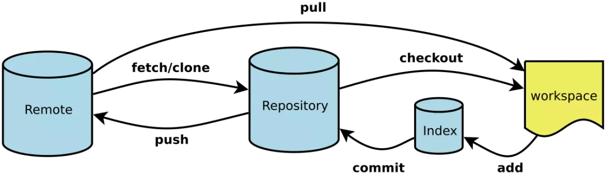
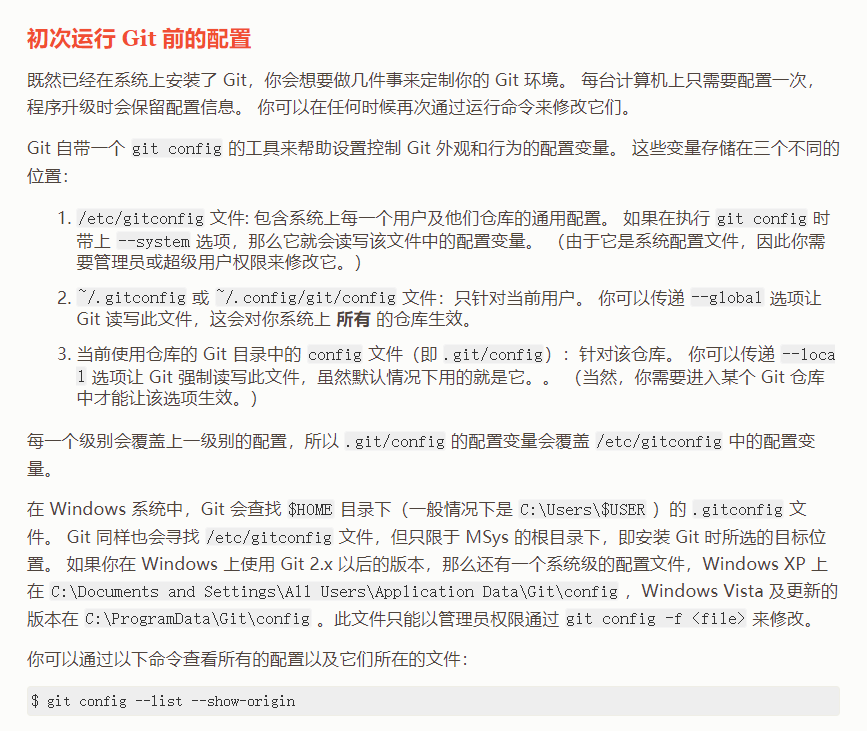
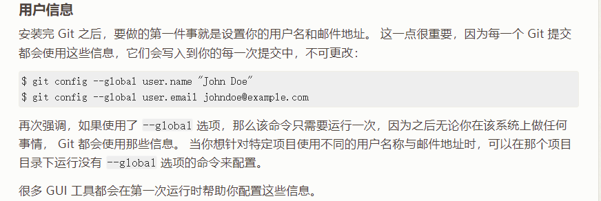

# Git用法
## git的工作原理

- Workspace：工作区
- Index / Stage：暂存区
- Repository：仓库区（或本地仓库）
- Remote：远程仓库
********************************
## 环境配置
**安装git之后需要设置用户名称和邮箱地址，每次提交都要使用该用户信息**
    
    设置用户信息
    git config --global user.name "用户名"
    git config --global user.email "邮箱地址"
    查看配置信息
    git config --list
    git config user.name
    通过上面的命令设置的信息会保存在~/.gitconfig文件中

**git config --global参数将会将该配置应用到所有仓库**
*******************************
## 本地初始化仓库
   - 在本地电脑需要创建仓库的位置创建一个新目录
   - 右键点击该目录，选择git bash here
   - 执行命令git init
*******************************
## 克隆远程仓库
-  git clone 远程仓库地址
***************************
## 本地工作目录状态
- untracked 未跟踪（未被纳入版本控制）
- tracked 已跟踪（被纳入版本控制）
- Unmodified 未修改状态
- Modified 已修改状态
- Staged 已暂存状态
*********************************
## 本地仓库操作
- git status 查看仓库状态(git status -s 输出简化的信息)
- git add 将untracked的文件加入暂存区
- git reset将暂存区的文件取消暂存
- git commit -m "本次提交的简要描述" 将暂存区的文件修改提交到本地仓库
- git rm 删除文件