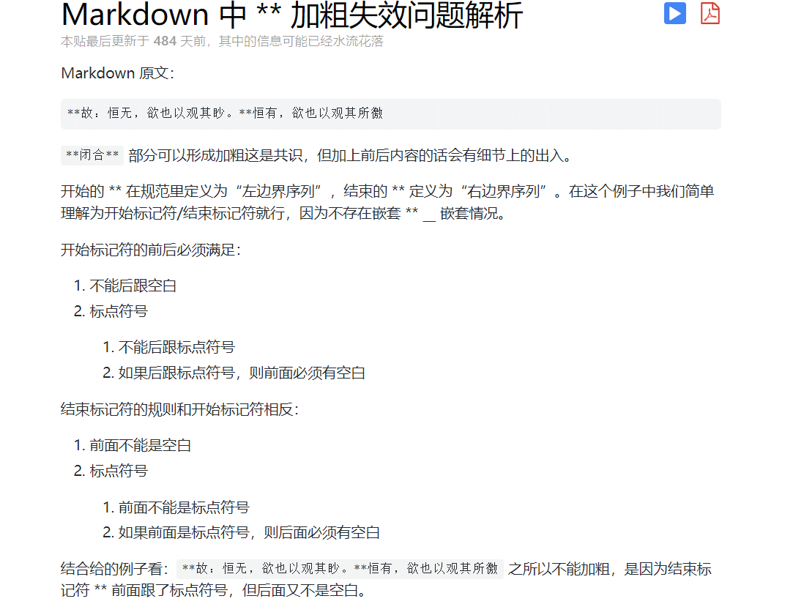

# MarkDown语法

## MarkDown换行格式
    如果行与行之间没有空行，则会被视为同一段落；
    如果行与行之间有空行，则会被视为不同段落；
    空行是指行内什么都没有，或者只有空格和制表符；（TAB）
    如果想在段内换行，则需要在上一行的结尾插入两个以上的空格然后回车。

-------------------------------------
## 字体设置斜体,粗体,下划线

    斜体: *斜体文字* /_斜体文字_    
    加粗: **加粗文字**
    倾斜并加粗: ***倾斜并加粗文字***
    删除线: ~~添加删除线的文字~~

------------------------------------
## 分割线
    用三个或以上的*或-表示

**注:使用-时需要空行防止与标题混淆**

------------------------------------
## 分级标题
    # 一级标题
    ## 二级标题
    ### 三级标题
    #### 四级标题
    ##### 五级标题
    ###### 六级标题

**注意:** `#`与标题之间有一个空格.

-----------------------
## 超链接
### 行内式
语法说明:

`[链接文字](链接地址 "链接标题"(鼠标悬停时显示的文字--为可选项))`

**注意:** 链接地址与链接标题之间有一个空格。

### 参考式
    语法说明:
    参考式分为两部分
    第一部分[链接文字][链接标记]
    第二部分[链接标记]:链接地址 "链接标题"

**注**:第二部分可以在文本的任意位置添加。

----------------------------------------
## 自动链接
    语法说明:
    <>所包起来的,MarkDown会自动把它转换为链接。

------------------------------------------
## 锚点
    语法说明:
    在准备跳转的标题位置插入锚点`{#标记}`在文档的其他地方写上锚点的链接`[链接文字](#标记)`。

--------------------------------------------
## 列表
### 无序列表
    语法说明
    使用- + *表示无序列表。
    e.g. "- xxxx"

**注**:`- + *`后需要一个空格。
### 有序列表
    语法说明:
    数字后跟上一个英文句点。
    e.g. "1. 标题"

**注**:英文句点后需加上一个空格。
### 列表嵌套
    语法说明:
    不同层级之间加一个tab缩进即可

---------------------------------------------------------
## 引用
    语法说明:
    在需要被引用的文本前添加>,引用可以嵌套。

-----------------------------------------------------
## 图片
    语法说明:
    行内式:
    插入互联网图片:
    插入本地图片:

>参考式同超链接参考式

>图片描述是显示在图片下方的文字(可选)

>图片标题是鼠标悬停在图片上时显示的文字(可选)

-------------------------------------------------------
## 代码区块
    在段落的开头加上一个tab缩进(代码区块和普通段落之间要有空行)

-------------------------------------------------------
## 表格
    语法说明:
    |表头|表头|
    |----|:--|
    |内容|内容|
>表头与内容之间用-分割,:表示左对齐或右对齐，两端都有则为居中